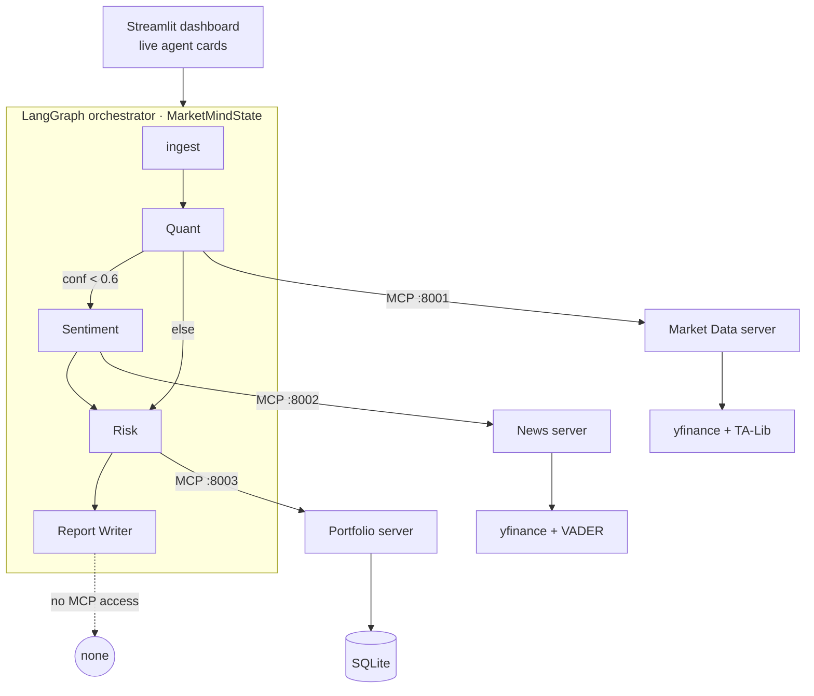

# MarketMind

**Multi-agent investment research.** The differentiator: the three MCP servers here are **authored from scratch, not consumed** — each wraps a real data domain (market data, news, portfolio) and exposes a tight, typed tool surface over Streamable HTTP. Four scoped agents sit on top, orchestrated by a LangGraph state machine: a **Quant**, **Sentiment**, and **Risk** agent each wired to exactly one server (least-privilege tool access), plus a **Report Writer** with no tool access that synthesizes their JSON into a single Markdown report where **every claim is tagged with the agent that produced it**. One ticker in, a cited recommendation out.

<!-- Demo GIF — drop a screen recording of `make demo` here -->


---

## Architecture



Each specialist agent connects to **exactly one** MCP server. The Report Writer connects to none — it only sees the other agents' outputs. The graph is sequential with a single conditional: a low-confidence Quant call routes through Sentiment before Risk; otherwise Sentiment is skipped.

<details>
<summary>ASCII version</summary>

```
 Streamlit  ─────────────►  LangGraph orchestrator
 (live cards)               ingest → Quant ─┬─(conf<0.6)→ Sentiment ─┐
                                            └─(else)──────────────►  Risk → Report Writer
                                              │            │            │          │
                                         MCP :8001     MCP :8002    MCP :8003   (no MCP)
                                              ▼            ▼            ▼
                                        Market Data     News       Portfolio
                                        yfinance+TA   yf+VADER      SQLite
```
</details>

---

## Why one MCP server per domain?

**Least-privilege tool access.** Each agent is handed only the tools of its single server — the Quant agent literally cannot reach `get_holdings`, the Risk agent cannot fetch news. Scoping is enforced in one place (`agents/factory.py::get_scoped_tools`), so a prompt-injected or misbehaving agent can't reach across domains. It also keeps each tool list small, which measurably improves tool-selection accuracy, and lets the three servers scale, deploy, and fail independently.

---

## Agents

| Agent | MCP server | Tools | Output |
|-------|-----------|-------|--------|
| **Quant** | Market Data `:8001` | `get_technicals`, `scan_signals`, `get_ohlcv` | `QuantResult` — BUY/HOLD/SELL + confidence, RSI, SMAs |
| **Sentiment** | News `:8002` | `get_recent_news`, `score_sentiment` | `SentimentResult` — label, VADER score, headline count |
| **Risk** | Portfolio `:8003` | `get_holdings`, `assess_position_risk` | `RiskResult` — concentration level, weights |
| **Report Writer** | *none* | *none* | Cited Markdown report + `[{claim, agent}]` |

## MCP tools (six core + one extension)

| Server | Tool | Signature → returns |
|--------|------|---------------------|
| Market Data | `get_ohlcv` | `(ticker, period="6mo", interval="1d")` → OHLCV rows |
| Market Data | `get_technicals` | `(ticker)` → RSI(14), SMA 50/200, last close, trend |
| News | `get_recent_news` | `(ticker, limit=12)` → articles `[{title, publisher, link, published, summary}]` |
| News | `score_sentiment` | `(headlines: list[str])` → compound, label, per-headline (VADER) |
| Portfolio | `get_holdings` | `(account_id="default")` → holdings, weights, sector breakdown |
| Portfolio | `assess_position_risk` | `(ticker, proposed_notional, account_id="default")` → current/projected weight, concentration |

**Extension:** `scan_signals(ticker)` on the Market Data server runs a personal TA-Lib relative-strength + six-condition buy scan vs the S&P 500.

---

## Quick start

```bash
make install              # create .venv, install deps
cp .env.example .env      # add your free GROQ_API_KEY
make seed                 # seed the SQLite portfolio
make demo                 # seed → start 3 servers → launch the dashboard
```

Then open the Streamlit URL and click **Analyze**. Other targets: `make servers` (servers only, Ctrl-C to stop), `make app` (dashboard only), `make pipeline` (CLI run), `make test` (agent smoke tests).

> Needs `make` + `bash` (native on macOS/Linux; use Git Bash or WSL on Windows). On macOS/Linux, TA-Lib needs its C library first: `brew install ta-lib` or `apt-get install ta-lib`.

### Environment variables

| Var | Purpose |
|-----|---------|
| `GROQ_API_KEY` | **Required.** Free Llama inference — get one at [console.groq.com/keys](https://console.groq.com/keys) |
| `AGENT_MODEL` | Groq model id (default `llama-3.3-70b-versatile`) |
| `LANGSMITH_API_KEY` / `LANGSMITH_TRACING` / `LANGSMITH_PROJECT` | Optional tracing (project defaults to `marketmind`) |
| `MARKET_DATA_MCP_URL` / `NEWS_MCP_URL` / `PORTFOLIO_MCP_URL` | Server URLs (default `localhost:8001-8003/mcp`) |

---

## What's next (v2)

Deliberately deferred to keep the MVP a single-machine `make demo`. Each is a known seam, not a missing piece:

- **A2A delegation** — agent-to-agent calls instead of a fixed graph, for dynamic routing.
- **Redis checkpoints** — durable, multi-process graph state in place of in-memory `MemorySaver`.
- **Pinecone semantic news** — vector recall over a news corpus, replacing the current headline-only VADER pass.
- **Kafka price streaming** — real-time tick ingestion (the personal scanner already had a Kafka path, stripped for the MVP).
- **Prometheus + Grafana** — server/agent metrics and latency dashboards.
- **Docker Compose** — one-command multi-container deploy.

---

## Stack

LangGraph · langchain-mcp-adapters · FastMCP (Streamable HTTP) · ChatGroq / Llama · yfinance · TA-Lib · VADER · SQLite · Streamlit · LangSmith.

See [`CLAUDE.md`](CLAUDE.md) for the full scope boundary, state contract, and tool signatures.
